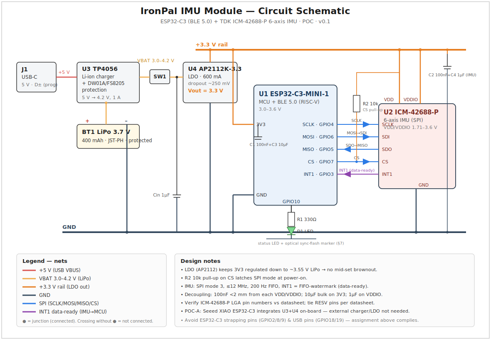
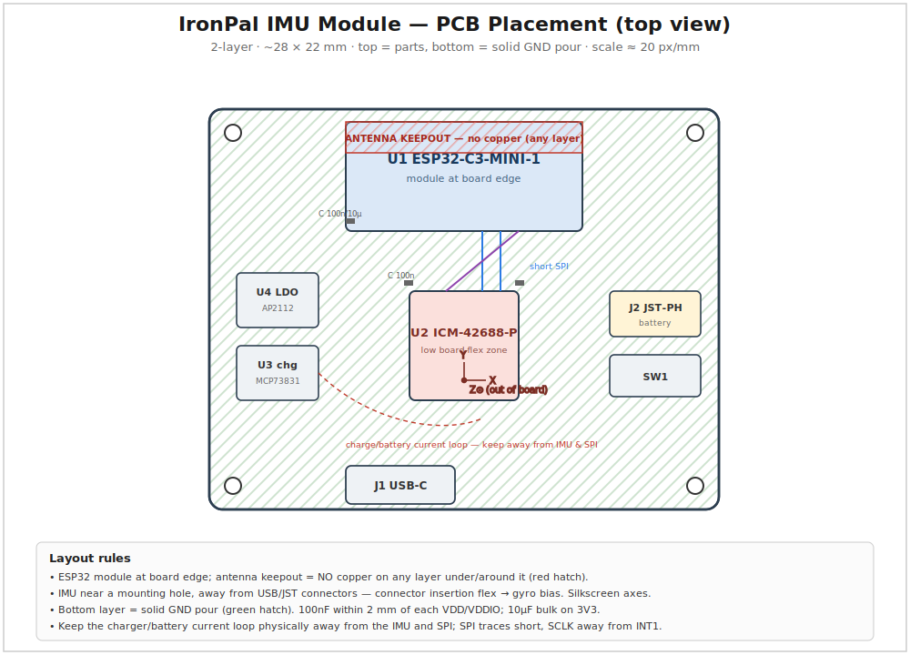

# IronPal — IMU POC Integration Plan (headband IMU + ELP camera)

**Status:** draft v0.1 · 2026-07-15 · **Owner:** founder (solo)
**Pairs with:** the ordered ELP IMX415 200° fisheye (`ironpal-capture-hardware-decision-log.md` §5),
the abstain-first weight harness (`docs/video-analysis-kb/ground-truth.md`), and the sensor-fusion /
IMU-gated strategy in `docs/video-analysis-kb/sensor-fusion.md` + `analysis-pipeline-strategy.md`.
This doc is the **concrete hardware+software POC** that realizes that strategy.

## 1. Goal & scope

Add a **6-axis IMU** to the headband **beside** the ELP camera (not inside it) so IronPal can fuse
first-person video with head motion. POC success = a **time-synchronized (video + IMU) capture rig**
that demonstrably improves **rep counting** and **exercise gating**, and quantifies exactly where a
**head-mounted** IMU helps and where it doesn't.

**In scope:** ESP32 + IMU BLE module, headband mount, firmware, phone-side capture + time-sync, a
labelled synced dataset, and a validation report. **Out of scope:** custom PCB, on-device ML training,
production enclosure — those follow only if the POC passes.

## 2. Why an IMU — and the honest limitation the hype skips

The reference material is right that an IMU is excellent for reps and exercise signatures. But one
thing must be stated plainly, because it shapes the whole POC:

> **A head-mounted IMU measures HEAD/torso motion, not the limb or the load path.** It gives a strong
> rep signal ONLY for exercises where the head moves with the rep — squat, deadlift, overhead press,
> pull-up, lunges, cleans. For **isolation / seated / fixed-head** movements — biceps curl, bench
> lockout, cable pushdown (KB **case 003**, whose axial reps were invisible to the head-cam!), leg
> extension — the head barely moves and the IMU sees little.

So the POC's real job is not to prove "IMU counts reps" in general (it can't, from the head) — it's to
**measure which exercises the head-IMU handles, and hand the rest to vision or a future limb IMU.**
This honest scoping is the deliverable.

**Weight:** the IMU **does NOT measure weight** (consistent with our marketing guardrails). It supplies
*tempo / velocity / range-of-motion / fatigue* context only. Weight stays a **vision-OCR + abstain +
confirm** problem (the harness). Do not let the plan imply the IMU reads load.

## 3. Division of labor (what the IMU does / doesn't)

| Task | Video (ELP fisheye) | Head IMU | Combined |
|------|--------------------|----------|----------|
| **Exercise ID** | strong (equipment, posture) | good for head-moving lifts; weak for isolation | strongest, esp. under occlusion |
| **Rep count** | good when limb in view | strong for compound/axial; ~none for fixed-head | best-of-both, exercise-dependent |
| **Weight** | OCR (abstain-first) | **none** (tempo/context only) | vision + user-confirm; IMU adds tempo |
| **Set gating** (start/stop) | expensive (must process video) | **excellent, low-power** — this is the killer use | IMU triggers video → saves battery + LLM cost |

The **highest-value IMU role for the POC is set gating**: sample the IMU at low power, and only start
video capture / LLM analysis when motion crosses a threshold. That cuts recorded video and per-session
LLM cost (ties to the LLM cost-estimation work) regardless of the rep-counting caveat.

## 4. Architecture

```
HEADBAND
├── ELP IMX415 200° fisheye  ── USB (UVC) ─────────┐
└── IMU module (3D-bracket, beside camera)         │
     ├── ESP32-C3 (BLE)                            │
     ├── 6-axis IMU (ICM-42688-P)                  │ BLE
     └── LiPo 400 mAh + charger                    │
                                                   ▼
                                                 PHONE  (React Native / Android)
                                                 ├── UVC video capture (phone-clock timestamps)
                                                 ├── BLE central (IMU packets + device timestamps)
                                                 ├── time-sync (clock-offset handshake)
                                                 ├── IMU-gating → segment sets
                                                 ├── rep detection (peak/valley)
                                                 ├── exercise classifier (IMU + video)
                                                 └── weight = vision OCR harness (abstain/confirm)
                                                   ▼
                                                  LLM  (session summary + form notes)
```

**Key advantage of our camera choice:** the ELP is **UVC USB into the phone**, so the *phone captures
both streams* and can timestamp them against **one clock**. That sidesteps the hardest part of the
reference plan's cross-device clock problem (a camera recording to its own SD card would force blind
post-hoc alignment). Video frames and IMU packets both land on the phone → sync is a latency-offset
problem, not a two-independent-clocks problem. (See §7.)

## 5. Bill of Materials (one POC unit)

> Quick view below; the **complete sourced shopping list** (exact MPNs, EU suppliers, quantities,
> tools, and alternatives) is in **Appendix D**.

| Item | Part | ~Cost |
|------|------|-------|
| MCU + BLE | ESP32-C3 Super Mini | €3–5 |
| IMU (6-axis) | **TDK ICM-42688-P** (low noise) breakout | €8–15 |
| — alt (less firmware) | Bosch **BNO085** (on-chip fusion → quaternions) | €18–22 |
| — alt (cheapest) | Bosch **BMI270** | €4–7 |
| Battery | LiPo 400 mAh | €4–6 |
| Charger (if not on board) | TP4056 module | €1 |
| Mount | 3D-printed bracket (clips to headband beside camera) | €2 |
| Wiring | JST, slide switch, hookup wire | €3 |
| **Total** | | **≈ €20–35** |

Sensor pick: **ICM-42688-P** for raw low-noise acc+gyro (best signal for rep/exercise algorithms and
future ML). **BNO085** if you want to skip fusion math for the POC (it outputs orientation directly)
— slightly less flexible, faster to a demo. Recommend ICM-42688-P; keep BNO085 as the fast-path option.

## 6. Hardware build

- [ ] 3D-print a small bracket that clips the ESP32+IMU+LiPo **beside** the ELP camera on the headband,
      IMU rigidly coupled to the band (loose mounting = noise). Keep total added mass < ~25 g.
- [ ] Wire IMU→ESP32 over SPI (preferred for ICM-42688-P at high rate) or I²C; LiPo→ESP32 via TP4056.
- [ ] Add a slide switch + a status LED (the LED doubles as the optional video sync marker, §7).
- [ ] Do NOT open/modify the camera (Option 1 from the brief — separate module, no camera hack).

## 7. Time synchronization (the crux — do this carefully)

Goal: align each IMU sample to a video frame within **< 1 frame (33 ms at 30 fps)**.

Layered approach:
1. **Common phone clock.** Phone stamps every captured UVC frame and every received BLE packet with its
   own monotonic clock. This alone gets you coarse alignment.
2. **Device-timestamped IMU + offset handshake (removes BLE jitter).** The ESP32 timestamps each sample
   with `esp_timer` (µs monotonic). On connect and every ~30 s, the phone runs an NTP-style round trip
   against a clock characteristic: `offset ≈ ((t1−t0)+(t2−t3))/2`, mapping `device_ts → phone clock`.
   BLE latency jitter (10–50 ms) then no longer corrupts sample timing.
3. **Optional hardware anchor (belt-and-suspenders).** Blink the status LED in the fisheye FOV at a
   known `device_ts`; the phone detects the flash frame and pins the two timelines exactly.
4. **First-light fallback.** A sharp head-nod / tap at set start creates a simultaneous video motion +
   IMU spike → manual eyeball alignment while the automatic path is being built.

## 8. Firmware (ESP32-C3)

- [ ] Configure IMU FIFO; sample **acc+gyro @ 200 Hz** (100 Hz min for reps; 200 Hz headroom).
- [ ] Timestamp each sample with `esp_timer` µs.
- [ ] BLE GATT service:
  - **IMU data** (notify): batched packets `[seq:uint16][device_ts:uint32][ax,ay,az,gx,gy,gz: int16 ×N]`.
    6-axis @200 Hz ≈ 2.8 KB/s — trivial for BLE; batch ~5–10 samples/notification.
  - **Control** (write): start/stop, set rate, LED-marker trigger.
  - **Clock** (read): current `esp_timer` µs for the offset handshake.
- [ ] Sequence numbers so the phone detects/logs dropped packets; on-chip ring buffer to ride out
      brief BLE stalls.
- [ ] Low-power idle mode: sample at reduced rate until motion > threshold (feeds §3 set-gating).

## 9. Phone-side (React Native / Android)

- [ ] BLE central: subscribe, parse packets, store `(seq, device_ts, phone_rx_ts, acc, gyro)`.
- [ ] UVC video capture to file with per-frame phone timestamps (or via the analysis pipeline's frame
      extractor if recording externally first).
- [ ] Run the §7 offset handshake; produce a `device_ts → video_frame` mapping.
- [ ] Persist a synced session bundle: `video.mp4` + `imu.jsonl` + `sync.json`.
- [ ] Feed weight frames to the existing `/weight-lifted-analysis` harness (unchanged; abstain-first).

## 10. Data pipeline & fusion (POC algorithms — keep simple first)

- **Set gating:** threshold on IMU accel magnitude variance → mark set start/stop → clip video windows.
- **Rep counting:** band-pass the accel magnitude (or vertical axis), detect periodic peaks/valleys,
  count full cycles; apply the exercise's rep definition (avoid double-counting the eccentric). Classic
  DSP first; a small temporal model (TCN/LSTM) only later if DSP is insufficient.
- **Exercise ID:** start with IMU features (dominant axis, cadence, RoM) + the video equipment/posture
  cue; simple classifier. Fuse (IMU disambiguates when the lens is occluded; video disambiguates when
  the head is still).
- **Weight:** unchanged — vision OCR + self-consistency gate + abstain→confirm. IMU only annotates
  **tempo (e.g. 2-1-3), rep-velocity decay, pauses**.

## 11. Validation plan & success criteria

Capture a labelled synced dataset across a spread of exercises (head-moving AND fixed-head):
squat, deadlift, overhead press, pull-up (head moves) · biceps curl, bench, cable pushdown, leg
extension (head still). For each, log ground-truth reps.

| Metric | Target |
|--------|--------|
| Video↔IMU alignment | **< 33 ms** (sub-frame @30 fps) |
| Rep count, **head-moving** lifts | within **±1** vs manual |
| Rep count, **fixed-head** lifts | *measured & documented* (expected weak — this is the finding) |
| Set-gating | recorded video reduced **> 50 %** vs continuous |
| Exercise ID (fused) | qualitative uplift vs vision-only, esp. under occlusion |
| Case-003 re-test | do IMU-gated + rep signals recover the pushdown reps vision missed? |

**Deliverable:** a table of *which exercises the head-IMU handles* → drives whether a future **limb/wrist
IMU** or vision remains the rep source per exercise. That map is the POC's real output.

## 12. Milestones (anchored to camera ETA ~Jul 29, 2026)

- [ ] **Now → Jul 29 (pre-arrival):** order IMU BOM (§5); print bracket; ESP32 firmware skeleton
      (IMU streaming + clock characteristic); phone BLE stub.
- [ ] **Week 1 (post-arrival):** assemble module; IMU → phone streaming; §7 offset handshake working;
      demonstrate < 33 ms alignment with the LED-marker test.
- [ ] **Week 2:** capture the labelled synced dataset (§11); rep-detection v1 (DSP); set-gating.
- [ ] **Week 3:** fused exercise ID; validation report + the exercise-coverage map; go/no-go on
      integrating IMU into the POC-v1 Android app.

## 13. Risks & mitigations

| Risk | Mitigation |
|------|-----------|
| **Head IMU ≠ limb motion** (isolation lifts) | scope it as a *finding*; plan for vision or wrist-IMU on those exercises |
| Time-sync drift | device timestamps + periodic re-handshake (§7); LED anchor |
| BLE dropouts | sequence numbers + on-chip ring buffer; log gaps |
| Loose IMU mount → noise | rigid bracket, IMU coupled to the band |
| Added bulk/mass on headband | keep < ~25 g; small LiPo; comfortable placement |
| Two-device charge/UX friction | acceptable for POC; single-device is the later custom-PCB revision |
| Over-claiming weight from IMU | doc + guardrails: IMU = tempo/context only, never load |

## 14. Relationship to the roadmap & next step

This POC is the **sensor-first, IMU-gated** step from `analysis-pipeline-strategy.md`, built on the
Option-1 recommendation (separate ESP32+IMU BLE module, no camera hack). It runs **in parallel** with
the camera's own 1a validation (does the fisheye read weights?). Sequence:
1. Order IMU parts now (arrives with/near the camera).
2. Validate the camera's weight-reading first (that gate decides the vision side).
3. Build this IMU rig; measure the exercise-coverage map for reps + prove set-gating.
4. If both pass → fold IMU + camera into a single custom device (Tier-2), and integrate the fused
   pipeline into the POC-v1 Android app.

---

# Appendix A — Electronic circuit design (ESP32 + IMU module)

Two build stages: **POC-A (breakout wiring)** — dev boards jumpered together, no PCB, working this
week; **POC-B (custom 2-layer PCB)** — the schematic below laid out small enough for the headband.
The schematic is identical; only the physical realization differs.

## A.1 Component list (with specs)

| Ref | Part | Package | Key ratings | Role |
|-----|------|---------|-------------|------|
| U1 | **ESP32-C3-MINI-1-N4** (module) / ESP32-C3 Super Mini (POC-A) | module | 3.0–3.6 V, BLE 5.0, RISC-V, integrated PCB antenna | MCU + BLE |
| U2 | **TDK InvenSense ICM-42688-P** | 14-pin LGA 2.5×3×0.91 mm | VDD/VDDIO 1.71–3.6 V, SPI ≤24 MHz, ±16 g / ±2000 dps | 6-axis IMU |
| U3 | **TP4056** (+ DW01A + FS8205A protection) | SOP-8 / module | Vin 4.5–5.5 V (USB), charge 4.2 V, Iprog set by Rprog | LiPo charger + protection |
| U4 | **AP2112K-3.3** LDO | SOT-23-5 | Vin ≤6 V, 600 mA, dropout ~250 mV @600 mA, Vout 3.3 V | 3.3 V rail (holds down to ~3.55 V LiPo) |
| BT1 | LiPo **3.7 V 400 mAh** | JST-PH 2.0 | 4.2 V max, ~1C | battery |
| SW1 | SPDT slide switch | — | >1 A | battery cutoff |
| D1 | LED (green) + R1 **330 Ω** | 0603 | 2 mA | status + optical sync marker (§7) |
| C1,C2 | **100 nF** X7R | 0402 | 16 V | decouple ESP32 3V3 + IMU VDD |
| C3 | **10 µF** X5R | 0805 | 10 V | bulk on 3.3 V rail |
| C4 | **1 µF** X7R | 0402 | 16 V | IMU VDDIO decouple |
| C5,C6 | **1 µF** X7R | 0402 | 16 V | AP2112 Vin / Vout (per datasheet) |
| C7 | **10 µF** | 0805 | 10 V | TP4056 output bulk |
| R2 | **10 kΩ** | 0402 | — | IMU CS pull-up (keeps SPI mode at boot) |
| J1 | USB-C receptacle | — | — | program + charge |

**Interface choice:** SPI (not I²C) between U1↔U2 — the ICM-42688-P runs SPI to 24 MHz and gives clean
high-ODR FIFO bursts; I²C (400 kHz–1 MHz) would bottleneck 200 Hz batched reads.

## A.2 Power path

```
USB-C (5V) ─► TP4056 (charge/protect) ─► SW1 ─► [LiPo 3.7V BT1]
                                          │
                                          └─► U4 AP2112K-3.3 (LDO) ─► 3V3 rail
                                                 Cin=1µF   Cout=1µF + 10µF(C3)
3V3 rail ─┬─► U1 ESP32-C3  (100nF + 10µF at 3V3 pin)
          └─► U2 IMU VDD & VDDIO (100nF at VDD, 1µF at VDDIO)
```
Rationale: the LiPo (3.0–4.2 V) can dip below 3.3 V near empty; a **low-dropout 3.3 V LDO (AP2112)**
keeps the rail regulated to ~3.55 V input so the IMU/BLE don't brown out mid-set. TP4056 handles
charge + over-discharge/over-current protection.

## A.3 Signal connections (net list — ESP32-C3 ↔ ICM-42688-P over SPI)

| ESP32-C3 GPIO | Net | ICM-42688-P pin (by signal) | Note |
|---------------|-----|------------------------------|------|
| GPIO4 | SPI_SCLK | SCLK | ≤12 MHz for POC; 24 MHz max |
| GPIO6 | SPI_MOSI | SDI | master-out |
| GPIO5 | SPI_MISO | SDO/AD0 | master-in |
| GPIO7 | IMU_CS | CS | + 10 kΩ pull-up (R2) → SPI mode latched |
| GPIO3 | IMU_INT1 | INT1 | data-ready / FIFO-watermark interrupt |
| GPIO10 | LED | — | D1 status + sync-flash marker |
| GPIO0/ADC | VBAT_SENSE | — | optional 1:2 divider off LiPo for fuel gauge |
| 3V3 / GND | power | VDD, VDDIO / GND | decouple per A.1 |

> ⚠️ **Verify physical LGA pin numbers against the ICM-42688-P datasheet pinout** before layout — the
> table above is by **signal name**; several LGA pins are RESV and must be tied/left per the datasheet
> (do not float or ground blindly). **Avoid ESP32-C3 strapping pins (GPIO2/8/9)** and the USB pins
> (GPIO18/19) for these nets — the assignment above already does.

## A.4 Schematic drawing

Full labelled circuit diagram (colour-coded rails, pin configs, voltage ratings, annotations):



> Source: [`assets/imu-poc-schematic.svg`](assets/imu-poc-schematic.svg) (vector — open in a browser
> to zoom). Nets: red = +5 V, amber = VBAT 3.0–4.2 V, orange = +3.3 V, dark = GND, blue = SPI,
> purple = INT1 data-ready. This drawing supersedes the earlier text netlist in §A.3 (kept as a
> quick reference table).

# Appendix B — PCB layout (POC-B, 2-layer)

Component-placement drawing (top view — antenna keepout, IMU stress-free zone, ground pour, routing):



> Source: [`assets/imu-poc-pcb-layout.svg`](assets/imu-poc-pcb-layout.svg). Red hatch = antenna
> keepout (no copper); green hatch = bottom-layer GND pour.

- **Stackup:** 2-layer, **top = signals + parts, bottom = solid ground pour**. Target ~20×28 mm so it
  clips beside the camera under ~25 g total.
- **ESP32-C3-MINI-1 antenna keepout (critical):** module at the **board edge**, antenna overhanging;
  **no copper on ANY layer under/around the antenna** (follow the module's keepout drawing). Nothing
  metallic (LiPo, traces, ground) beneath it.
- **IMU placement (critical for signal quality):** the ICM-42688-P is **stress-sensitive** — place it
  near a **mounting hole / the rigid part of the board**, away from board-flex zones and the JST/USB
  connectors (connector insertion force warps the board and shows up as gyro bias). **Align the IMU
  axes to the headband/camera frame and silkscreen the axis orientation** so recorded data maps to head
  motion unambiguously.
- **Decoupling:** each 100 nF within **<2 mm** of its VDD/VDDIO pin, ground via right at the cap; 10 µF
  bulk near the LDO output.
- **Grounding:** one continuous ground plane; keep the **TP4056 charge/battery current loop** (1 A,
  warm) physically **away from the IMU and the SPI lines** so charge noise doesn't couple in.
- **Routing:** SPI (SCLK/MOSI/MISO) short and grouped; keep **SCLK away from INT1** and from analog; CS
  pull-up near the IMU. Battery/charge traces wide (≥0.5 mm). Provide a thermal relief/copper pour for
  the TP4056.
- **Test/keep-alive:** breakout SWD-equivalent (ESP32-C3 uses USB-JTAG) via the USB-C; add a boot/reset
  pad pair.

# Appendix C — Firmware considerations (data acquisition · timestamping · BLE)

**Stack:** ESP-IDF + **NimBLE** (lighter than Bluedroid on the C3). SPI via the IDF SPI-master driver.

**IMU acquisition**
- SPI **mode 3 (CPOL=1, CPHA=1)**, ≤12 MHz for POC.
- Configure ICM-42688-P: **ODR 200 Hz**, accel **±8 g** (headroom for jerky racks) or ±16 g, gyro
  **±2000 dps**; enable the **FIFO** (packed 16-bit) and **FIFO-watermark → INT1**.
- Read the FIFO in **bursts on the watermark ISR** (e.g. every ~10 samples) rather than one-sample
  polling → far less SPI/CPU overhead and stable timing.

**Timestamping (feeds §7 sync)**
- On the watermark ISR, latch `esp_timer_get_time()` (µs, monotonic) for the burst; combine with the
  IMU FIFO's internal per-sample timestamp/interval to assign each sample an absolute `device_ts`.
- Expose a **Clock characteristic** returning current `esp_timer` µs so the phone can run the
  NTP-style offset handshake (§7) and map `device_ts → phone/video clock`.

**BLE (GATT)**
- Custom service, three characteristics: **IMU-data (notify)**, **Control (write)**, **Clock (read)**.
- Negotiate **MTU ~247** and **batch ~10–20 samples per notification**: packet =
  `[seq:u16][burst_device_ts:u32][ax,ay,az,gx,gy,gz : i16 × N]`. 6-axis @200 Hz ≈ 2.8 KB/s — trivial.
- Request a **low connection interval (7.5–15 ms)** for latency; **sequence numbers** so the phone
  detects drops; an on-chip **ring buffer** (drop-oldest, log gaps) rides out brief BLE stalls.

**Power / set-gating**
- Between watermark bursts, **light-sleep** the CPU.
- Idle mode: put the IMU in **wake-on-motion** (low-power accel + motion INT) and keep BLE in a slow
  interval; on motion INT, ramp to 200 Hz + start streaming → this is the **low-power set-gating** that
  triggers video capture (§3) and cuts battery + LLM cost.

**Control/robustness**
- Control characteristic: start/stop, set ODR/FSR, fire the LED sync-flash at a returned `device_ts`.
- Watchdog + reconnect logic; persist config in NVS.

---

# Appendix D — Shopping list, BOM & tooling

Two paths, buy in this order: **POC-A** (dev boards + breakouts, jumpered — build it *this week*, no
PCB, no reflow) then **POC-B** (the custom board from Appendix A/B, fab+assembled). Prices are 2026
indicative EUR incl. typical EU retail markup; MPN = manufacturer part number. Founder is in Slovakia,
so EU-stocking suppliers (TME/Berrybase/Botland/Mouser-EU) are prioritised to dodge customs friction.

## D.1 POC-A shopping list — buy this now (dev-board build)

| # | Item | MPN / SKU | Qty | Supplier (EU-first) | ~Unit € | Notes |
|---|------|-----------|-----|---------------------|---------|-------|
| 1 | **Seeed XIAO ESP32-C3** (MCU+BLE, **on-board LiPo charging** + U.FL) | Seeed 113991054 | 1 | Berrybase / Botland / Seeed | 6–8 | Preferred: built-in charge IC → **skips the TP4056**. Comes with antenna. |
| 1-alt | ESP32-C3 **Super Mini** | generic | 1 | AliExpress / Amazon.de | 3–5 | Cheaper but **no onboard charging** → add item 4. |
| 2 | **ICM-42688-P breakout** (pre-soldered — avoids LGA reflow) | Adafruit **4759** (STEMMA QT) | 1 | Berrybase / Pimoroni / Mouser | 13–16 | The reason to breakout: the bare LGA is not hand-solderable. |
| 2-alt | ICM-42688 breakout (cheap) | Waveshare / generic | 1 | AliExpress / Waveshare | 5–8 | Verify it's **42688-P**, not a BMI/MPU clone. |
| 3 | **LiPo 3.7 V 400–500 mAh**, JST-PH 2.0, **with protection** | Adafruit 2750 (500 mAh) / generic | 1 | Berrybase / TME | 6–9 | Protected cell only. Match connector polarity to the board! |
| 4 | TP4056 **USB-C charger + protection** module (only if 1-alt) | generic (DW01+FS8205) | 0–1 | AliExpress / Amazon.de | 1–2 | Not needed with the XIAO (item 1). |
| 5 | SPDT **slide switch** | generic | 1 | TME / Botland | 0.5 | Battery cutoff. |
| 6 | **LED** 3 mm green + 330 Ω resistor | generic | 1 | (from kit) | 0.2 | Status + optical sync marker (§7). XIAO's onboard LED can stand in for POC-A. |
| 7 | **Dupont jumper wires** (F-F) + mini breadboard/perfboard | generic | 1 set | Amazon.de / TME | 5–8 | Prototype wiring; perfboard for a sturdier build. |
| 8 | Pin headers (2.54 mm) | generic | 1 strip | TME | 0.5 | If boards ship without headers. |
| 9 | **3D-printed bracket** (headband clip) | print PETG/ABS | 1 | own printer / JLCPCB 3D / local | 2–4 | PETG for durability; align + mark IMU axes. |
| | **POC-A subtotal** | | | | **≈ €40–55** | one working unit (excl. tools) |

## D.2 POC-B additional BOM — custom PCB (from Appendix A)

Order these only after POC-A validates. Bare passives/ICs are cheapest at **LCSC** (pairs with JLCPCB
assembly). Quantities include modest spares (SMT parts are lost/tombstoned easily).

| Ref | MPN | Supplier | Qty/unit | Buy qty | ~€ (buy qty) |
|-----|-----|----------|----------|---------|--------------|
| U1 | ESP32-C3-MINI-1-N4 (Espressif) | LCSC / Mouser | 1 | 5 | 12–18 |
| U2 | ICM-42688-P (TDK InvenSense) | Mouser / DigiKey / LCSC | 1 | 5 | 30–45 |
| U3 | MCP73831T-2ACI/OT charger *(cleaner than TP4056 for a custom board)* | Mouser / LCSC | 1 | 5 | 4–7 |
| U4 | AP2112K-3.3TRG1 (Diodes) LDO | LCSC / Mouser | 1 | 10 | 3–5 |
| — | Caps 100 nF/1 µF/10 µF (0402/0805) X7R/X5R | LCSC | ~8 | 1 reel ea | 3–6 |
| R1/R2 | 330 Ω / 10 kΩ 0402 | LCSC | 2 | 1 reel ea | 1–2 |
| J1 | USB-C receptacle (16-pin, e.g. GCT USB4085) | LCSC / Mouser | 1 | 5 | 4–8 |
| J2 | JST-PH 2.0 SMD (battery) | LCSC | 1 | 10 | 2–4 |
| SW1 | SPDT slide switch SMD | LCSC | 1 | 10 | 2–4 |
| PCB | 2-layer, ~20×28 mm | **JLCPCB** | — | 5 pcs | 4–6 + ship |
| PCBA | JLCPCB SMT assembly (**let them place the LGA IMU**) | JLCPCB | — | 5 pcs | 15–40 setup |
| | **POC-B build (5-unit run)** | | | | **≈ €90–160 total** → per-unit drops fast |

> Strong recommendation: use **JLCPCB PCBA** to place U1/U2 — hand-placing the ICM-42688-P LGA and the
> MINI-1 module by hand is error-prone. Solder only the through-hole/large parts (JST, switch) yourself.

## D.3 Tools & equipment (assembly + test)

One-time; skip anything you already own.

| Tool | Suggested | ~€ | Why |
|------|-----------|----|-----|
| Temp-controlled soldering iron | Pinecil V2 / Hakko FX-series | 40–60 | fine-pitch headers, breakout pins |
| Solder + flux + wick | leaded 0.5 mm + no-clean flux pen | 10–15 | leaded is easier for POC |
| Fine tweezers + flush cutters | ESD tweezers | 8–12 | SMT + wire work |
| **Multimeter** | any (continuity + DC V) | 15–30 | verify 3V3 rail, shorts, polarity **before** connecting LiPo |
| **USB-C data cable** | quality data cable | 5 | program/charge (not charge-only!) |
| Logic analyzer (8-ch) | generic "Saleae-clone" | 8–12 | debug SPI/INT if the IMU is silent — very worth it |
| ESD strap/mat | wrist strap | 8 | IMU + ESP are ESD-sensitive |
| LiPo safety bag | fireproof bag | 6–10 | charge/store cells safely |
| Magnifier / USB microscope | 10–200× | 15–30 | inspect breakout joints / LGA (POC-B) |
| Helping-hands / PCB vise | generic | 8–15 | hold boards while soldering |
| 3D printer *or* print service | PETG/ABS | — | the bracket (item 9); JLCPCB/local if no printer |
| *(POC-B only)* hot-air rework | 858D-class | 30–50 | **only if** you self-assemble SMT instead of JLCPCB PCBA |

## D.4 Sourcing recommendations & alternatives

**Where to buy (Slovakia-friendly):**
- **TME (PL)** & **Botland (PL)** — EU warehouses, cheap fast shipping to SK, no customs surprise. Best
  for passives, switches, LiPo, tools.
- **Berrybase (DE)** — XIAO/ESP boards, breakouts, LiPos; fast EU delivery.
- **Mouser / DigiKey (EU)** — genuine TDK/Espressif silicon for POC-B; higher small-order shipping.
- **LCSC + JLCPCB (CN)** — cheapest bare components + fab + assembly for POC-B (accept ~1–2 wk shipping
  and prepaid import, like the camera).
- **AliExpress / Amazon.de** — cheapest dev boards & generic breakouts for POC-A; verify the IMU is a
  real ICM-42688-P.

**Component alternatives (all drop-in for the plan):**
- **IMU:** ICM-42688-P (primary, low noise) → **BMI270** (cheapest, very common in wearables) →
  **BNO085/086** (on-chip sensor fusion → quaternions, least firmware) → **LSM6DSV16X** (ST, ML core).
  Any 6-axis with SPI + FIFO + data-ready INT works; re-check register map in firmware.
- **MCU:** XIAO ESP32-C3 (charging built in) → ESP32-C3 Super Mini → **Seeed XIAO nRF52840** (lower BLE
  power, if battery life dominates) → ESP32-S3 (more RAM/compute for on-device DSP).
- **Charger:** XIAO onboard → TP4056 module (POC-A) → MCP73831 (POC-B custom).
- **Battery:** any protected 3.7 V LiPo 300–500 mAh with JST-PH 2.0; larger = longer runtime vs mass.

**Quality guidance:** buy the **IMU and ESP from reputable channels** (Adafruit/Mouser/Seeed/Berrybase)
— counterfeit/relabelled IMUs are common on the cheapest AliExpress listings and will waste days of
"why is my gyro noisy" debugging. Passives, switches, wires, LiPo: generic EU stock is fine.

## D.5 Cost summary

| Line | ~€ |
|------|----|
| **POC-A unit** (D.1) | 40–55 |
| **Tools** you don't already own (D.2, one-time) | 60–150 |
| **POC-B** custom-board 5-unit run (D.2, later) | 90–160 |

**Bottom line:** ~**€40–55 in parts** (plus tools) puts a working, jumpered ESP32-C3 + ICM-42688-P BLE
IMU on the bench this week — matching the ELP camera's arrival — with **no PCB and no reflow required**.
Defer POC-B until POC-A + the camera's weight-reading gate both pass.
